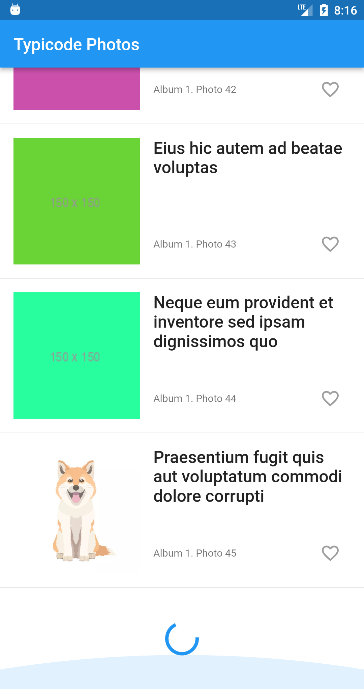
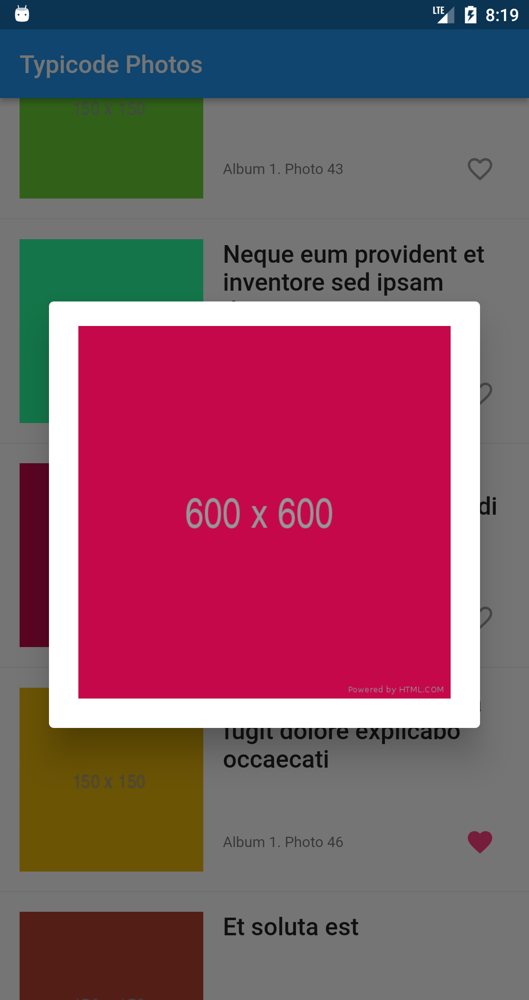

# typicode_photos

The app name is **Typicode Photos** because it consumes and renders photos from https://jsonplaceholder.typicode.com/photos  

*Built with Flutter applying SOLID and Clean Architecture.* 
Used packages: bloc, hive, retrofit, rxdart, flutter_hooks, connectivity_plus, freezed, dartz, and others. 

**Technical requirements**. 

- Create an infinite scroll list with images (use https://jsonplaceholder.typicode.com/photos as the API source). 
- Apply the pagination using parameters **_start** and **_limit** (e.g. **https://jsonplaceholder.typicode.com/photos?_start=15&_limit=15**)
- Each image in the list has a title, an image preview, and a like button. 
- By tapping on a preview image user is shown a full-sized image in a popup. 
- Users can like and unlike images by tapping the like button. 
- Like state persists between app launches.  

<nobr></nobr> 

**App extra feature using connectivity_plus**  
With the [connectivity_plus](https://pub.dev/packages/connectivity_plus) plugin help app tries to load automatically
for the next chunk of the data if we had an error and detected the network availability.

**The app supports states**  
- when nothing been loaded, and we are trying to load showing progress
- when nothing been loaded, and we got some network with the message and retry button
- when we have some data loaded, and we are trying to load more automatically showing progress in the very end of the list view
- when we have some data loaded, and we got some network error with the message and retry button in the very end of the list view
- when we have data loaded and reached the end with showing an appropriate message in the very end of the list view

*PS*: I tried to use the latest [infinite_scroll_pagination v3.1.0](https://pub.dev/packages/infinite_scroll_pagination)
package (actual on Mar 6, 2022), but unfortunately, it had one blocking issue amongst others for completing the assignment.
Therefore, I decide to implement an appropriate functional by myself.

----------------------

Best regards, 
Max Shemetov 

March, 2022
